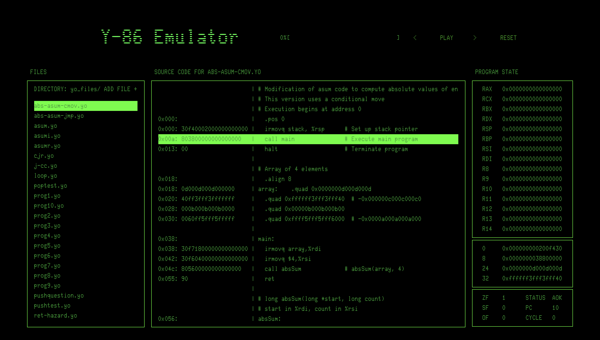

# Y-86 Emulator
A Y86-extended instruction set CPU emulator with a retro-themed web-based UI 



# Setup
### Requirements
```
Python 3.10.8
Node.js v18.11.0
Yarn v1.22.19
```
### Running
Make sure you are at the project root
```
$ yarn
$ yarn dev  
```
The web UI can now be accessed at [localhost:5173](http://localhost:5173)

# Architecture
```
[CPU-Emulator] → [REST API] → [Web UI]
```
The CPU emulator takes in a Y86 object file (.yo file) through `stdin` and output to `stdout` the program state after every a single instruction executed represented in JSON format.

The REST API is responsible for communications between the web interface and the emulator, having API endpoints that either act as a file system manager for .yo files and calls the CPU emulator to execute specific .yo files.

The web-interface is just for controlling which .yo file to execute, suspend or resume program execution.

# CPU-Emulator Design
The CPU Emulator is a 64-bit implementation of the Y86 architecture in accordance to what is specified in CS:APP with some extra caveats.

### Usage:
```
$ python y86 < [.yo file path]                          # OR
$ python y86 --state [starting program state in JSON]   
```

### Features:
- It is written in Python using only the standard library.
- Supports the base Y86 instruction set and three extra ISA64 instructions, namely `isubq`, `iandq` and `ixorq`.
- It is a **non-pipeline** implementation, meaning that the fetch-execute cycle is carried out in one single process rather than being broken up into multiple stages.

### Extended Instruction Table
```
+-------------+-------+-------+-----------+
| Instruction | Byte0 | Byte1 | Byte[2-9] |
+-------------+-------+-------+-----------+
| ISUBQ       | c 1   | f Rb  | V         |
| IANDQ       | c 2   | f Rb  | V         |
| IXORQ       | c 3   | f Rb  | V         |
+-------------+-------+-------+-----------+
```

## Implementation
The CPU can be broken up into these 5 components:
### MEM ( Memory )
- Abstracted through a `Memory` class
- Internally it uses a dictionary `dict[int, int]` where:
    - the `key` represents the address in bytes of which the byte value resides
    - this `value` represents a byte value
- It have four different method for interacting with itself, namely `get_byte`, `get_quad`, `set_byte`, `set_quad`
- Accessing byte with address keys that **do not exist** in the internal dictionary returns a byte with a value of 0
- Accessing invalid address ( address < 0 ) will raise BadAddress which will be caught by `CPU` in its `fetch_decode_execute` sets the `STAT` to `ADR`
- `load_yo_buffer` parses a .yo file buffer and load the bytecode into itself.
- `from_json` and `to_json` deserialize and serialize itself into a dictionary `dict[int, int]`, where each `key` represents address in bytes and `value` represent a quad-size value represented in a signed 64-bit integer.

### REG ( Registers )
- Abstracted through a `Registers` class
- Internally it uses a fixed-size list `list[int]` of length 15, each element represents a specific register value, with its index specifying the register.
```
+--------+----------+
| Index  | Register |
+--------+----------+
|      0 | RAX      |
|      1 | RCX      |
|      2 | RDX      |
|      3 | RBX      |
|      4 | RSP      |
|      5 | RBP      |
|      6 | RSI      |
|      7 | RDI      |
|      8 | R8       |
|      9 | R9       |
|     10 | R10      |
|     11 | R11      |
|     12 | R12      |
|     13 | R13      |
|     14 | R14      |
+--------+----------+
```
- `from_json` and `to_json` deserialize and serialize itself into a dictionary `dict[str, int]`, where:
    - `key` represent the register
    - `value` represent the register quad-size value represented in a signed 64-bit integer.

### CC ( Condition Codes )
- A dictionary `dict[str, int]` where:
    - `key` represents the conditional flag `ZF`, `SF`, `OF`
    - `value` represents the value of the conditional flag
- It is updated whenever `OPQ` and `IOPQ` is executed.
```
- `a` represents either `Ra` in `OPQ` or `V` in `IOPQ`
- `b` represents `Rb` before operation
- `t` represents `Rb` after operation
- All resulting values will be converted into `1` or `0` based on the truthiness of the value

+----------+--------+---------------+---------------------------------------+
| Operator |   ZF   |      SF       |                  OF                   |
+----------+--------+---------------+---------------------------------------+
| ADD      | t == 0 | t & (1 << 63) | (a < 0 == b < 0) and (t < 0 != a < 0) |
| SUB      | t == 0 | t & (1 << 63) | (a < 0 == b < 0) and (t < 0 != b < 0) |
| AND      | t == 0 | t & (1 << 63) | 0                                     |
| XOR      | t == 0 | t & (1 << 63) | 0                                     |
+----------+--------+---------------+---------------------------------------+
```
### PC ( Program Counter )
- A integer `int` representing current executing instruction address

### STAT ( Status )
- A integer `int` represent current program status, it can be of 4 values:
```
+--------+-------+
| Status | Value |
+--------+-------+  
| AOK    |     1 |      # The program is executing normally
| HLT    |     2 |      # The program encountered a `halt` instruction and will stop running
| ADR    |     3 |      # The memory is accessed with an invalid address
| INS    |     4 |      # The program encountered a bad instruction
+--------+-------+

```

The CPU is itself abstracted through a `CPU` class, it houses the above components and have various methods to emulate running a program, of which the most important method is the `fetch_decode_execute` method.

### Program Execution Lifecycle
1. The CPU calls `load_program` which takes in a .yo file buffer redirected from `stdin` and calls `load_yo_buffer` in `MEM` to parse and load the bytecode of said .yo file into memory.
2. The CPU calls `run` method, which is a generator that can be paused, each time yielding the current state of the program in JSON form after calling `fetch_decode_execute`
3. The `fetch_decode_execute` as the name implies, first fetch the byte residing in the address of PC, checking if the byte is the opcode for any of the valid instructions:
    - if it isn't, the method raises `BadInstruction`, setting the `STAT` to `INS` and halting the program.
    - if it is, decode the rest of the instruction byte code, including getting the registers, immediate values or getting quad-value from the memory.
    - executes the instruction and modifies the program state. Of note:
        - if instruction is `OPQ` or `IOPQ`, update `CC` after execution
        - if instruction is `CMOVXX` or `JXX`, condition is first calculated based on `CC` before determining program state should be modified
```py
def fetch_decode_execute(self):
        opcode = self.MEM.get_byte(self.PC)                             # `fetch` the current byte PC is pointing to
        icode, ifun = bisect_byte(opcode)                               # bisect the byte into two 4-bit value
        try:
            if opcode == OPCode.HALT:
                ...
            ...
            elif opcode == OPCode.RMMOVQ:
                ra, rb = bisect_byte(self.MEM.get_byte(self.PC + 1))    # `decode` stage of the cycle
                val_c = self.MEM.get_quad(self.PC + 2)
                val_a = self.REG[ra]
                val_b = self.REG[rb]
                val_e = val_a + val_b
                self.MEM.set_quad(val_e, val_a)                         # `execute` stage of the cycle
                self.PC = self.PC + 10
            ...
            elif opcode in (OPCode.ADDQ,
                            OPCode.SUBQ,
                            OPCode.ANDQ,
                            OPCode.XORQ):
                ra, rb = bisect_byte(self.MEM.get_byte(self.PC + 1))
                val_p = self.PC + 2
                val_a = self.REG[ra]
                val_b = self.REG[rb]
                val_e = self.op(ifun)(val_a, val_b)                     # gets the operator based on `ifun`
                self.update_CC(ifun, val_a, val_b, val_e)               # updates CC
                self.REG[rb] = val_e
                self.PC = val_p
            ...
            elif opcode in (OPCode.JMP,
                            OPCode.JLE,
                            OPCode.JL,
                            OPCode.JE,
                            OPCode.JNE,
                            OPCode.JGE,
                            OPCode.JG):
                val_p = self.PC + 9
                if self.cond(ifun):                                     # check condition based on `ifun` and `CC`
                    val_c = self.MEM.get_quad(self.PC + 1)
                    self.PC = val_c
                else:
                    self.PC = val_p
            ...
            else:
                raise BadInstruction
        except BadAddress:
            self.STAT = STATCode.ADR
        except BadInstruction:
            self.STAT = STATCode.INS
```
```
# CMOVXX / JXX Condition 
+------+-----------------+
| COND |      VALUE      |
+------+-----------------+
| NC   | 1               |
| LE   | ZF ^ OF | SF    |
| L    | SF ^ OF         |
| E    | ZF              |
| NE   | !ZF             |
| GE   | !(ZF ^ OF)      |
| G    | !(ZF ^ OF | SF) |
+------+-----------------+
```
4. A single `fetch_decode_execute` cycle is completed, control is yielded back to `run` and `run` yields back the modified program state.
5. The above process is repeated until `STAT` is no longer `AOK`
6. All the states yielded by `run` will be output to `stdout` in JSON form.

### Notes
- The emulator only runs until it reaches 10,000 cycles, for programs that either have dead infinite loops or does not halt until after 10,000 cycles, a `--state` option can specify a starting program state, in which case one could use the 10,000th cycle program state to resume execution.


# REST API Design
A simple RESTful API server written in Typescript using the Express framework

### Endpoints
- `GET /yo_files`
    - Returns all the files located in the `/yo_files` directory, includes the initial test .yo files
- `POST /yo_files`
    - Uploads the file in `multipart/form-data` and put the file in `/yo_files`
- `POST /exec/:target`
    - Executes the program specified by `target`, returns the array of program state returned by the emulator.
    - It executes the emulator by running a child process and parses the `stdout` output to JSON form.

# Web UI Design
The web UI is written using Vite + Vue in Typescript, it interacts with the emulator through using HTTP request calls to the RESTful API, never directly interacting with the emulator itself.

A web UI can usually be separated into three distinct parts, namely state, view and actions.

In general, actions change state, state change view.

### State
State represents the reactive data in a web UI, in this context, state might represent anything from the array of program state fetched from RESTful API to the current .yo file we are executing.

**Should state change, view would also be updated accordingly to reflect the new state.**

In Vue this is abstracted through the use of `ref`, `computed` and much more but only both `ref`, `computed` is used in this interface.

- setting a ref's value through `ref.value = newValue` will cause view using the ref value to reflect the new change.
- `computed` instead of being set values manually, insteads computes a value based on a callback.

All state logic in the web UI is mostly contained inside the `composables` folder:
```
.
└── composables/
    ├── useYoFile.ts           
    ├── useCpu.ts               # the current executing program state
    └── useApi.ts               # API calls to RESTful API
```
- `useYoFile`
    - Handles .yo files listing, selecting and uploading
    - Populates files by calling `/yo_files` endpoint from RESTful API and the current executing file to the first file in files on start.
    - `context` is a object where:
        - `key` represents the line's address
        - `value` represents the line`s line number
        - it is used for highlighting current executing instruction line.
```ts
type YoFile = { name: string, content: string }
type YoFileContext = Record<number, number>;

interface UseYoFile {
  file: Ref<YoFile | undefined>;                // Current executing file
  files: Ref<YoFile[]>;                         // All the files in `yo_files` directory
  context: ComputedRef<YoFileContext>;          // Table for address to line number conversion
  uploadYoFile: (file: File) => Promise<void>;  // Function for uploading .yo file
}
```

- `useCPU`
    - Handles the current executing program state
    - On start, `history` is populated through calling `/exec/:target` endpoint based on `useYoFile's` `file`, after being populated.
    - `halting` is computed by checking if the last program state's STAT in `history` is not AOK.
    - `state` is computed just by getting program state from `history` at index `cycle`
    - Should the program is **not halting** and the cycle reaches 80% of the total current available program state's in `history`, it calls `POST exec/` and sends the `history` last state as the starting program state, upon getting the new program states, it extends `history` value
```ts
interface UseCPU {
    history: Ref<CPUState[]>                    // List of program state
    cycle: Ref<number>                          // Current executing cycle
    state: ComputedRef<CPUState | undefined>    // Current cycle program state 
    halting: ComputedRef<boolean>               // Does the current executing program halt based on available history
}
```

- `useAPI`
    - Handles RESTful API calls, uses `axios`

### View and Action
View represents what user see in the interface, Vue breaks down view into different component, each component is organized in a _SFC (Single File Component)_ manner, where JS, HTML, CSS are aggregated into a single file.

Action is how view allows the user to interact and change the state.

The general layout of the interface can be divided into four different sections, that is `top-right`, `middle-left`, `center`, `middle-right`

All components are contained in the `components` folder
```
.
└── components/
    ├── YoFileExplorer.vue
    ├── YoFilePreview.vue
    ├── YoProgramController.vue
    └── YoProgramState.vue
```

- `YoFileExplorer`
    - The middle-left part of the interface.
    - uses `file` and `files` from `useYoFile` to change current selected .yo file and list out all the .yo files.
    - it highlights the selected file by checking if the filename is the same with the current selected file and adds a `active` class to highlight
    - the chevron cursor is added through `:hover` and `::before` pseudo-element adding.
    - Clicking on `ADD FILE +` uploads a file to the RESTful API.
    - Clicking on the file listing selects the current executing program.

- `YoFilePreview`
    - The center part of the interface
    - use `file` from `useYoFile` to display the current selected file content.
    - use `context` from `useYoFile` and `state` from `useCPU` to highlight to current executing line by adding calculating line number from `context` and adding `active` class to the appropriate element at the line number.

- `YoProgramController`
    - The top-right of the interface
    - includes the various buttons that control the program execution by incrementing or decrementing `cycle`
    - Pausing and resuming program execution of implemented using `setInterval`.
    - Progress bar percentage is calculated through computing `Math.ceil((cycle.value / history.length - 1) * 100)`. If they program does not seem to be halting, it displays `?%`

- `YoProgramState`
    - The middle-right of the interface
    - Displays all details of the program state ( REG, MEM, CC, STAT, PC, CYCLE )
    - Clicking on the memory section cycles through all the address with values